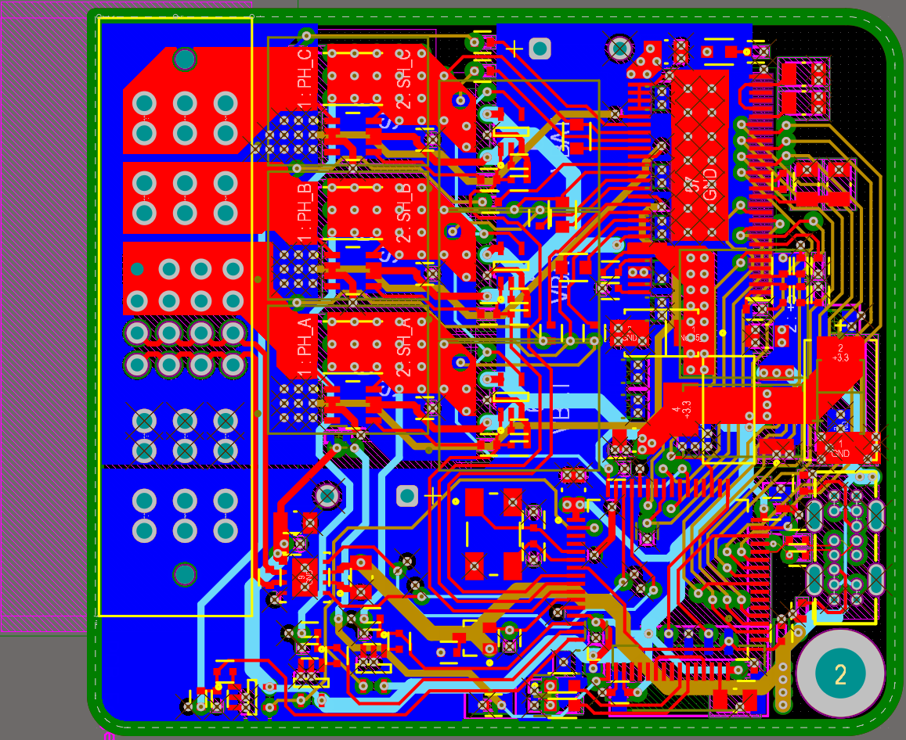
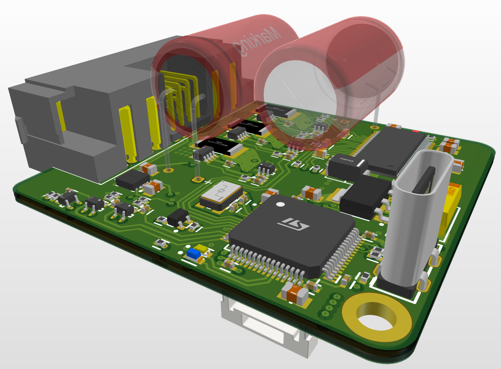
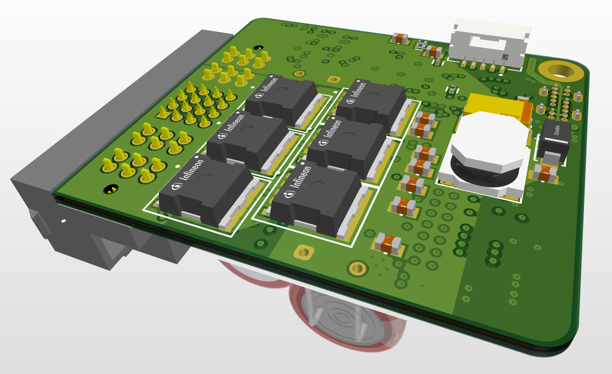

# Project BEESC

This is a custom ESC based on the VESC6 architecture that is planned to be pin compatible with the Bumblebee AUV5.0 vehicle.

## Current Design

2D View:

3D View (Top):

3D View (Bottom):

6 layer used due to high density of components, stack-up used is the standard SIG-GND-SIG-SIG-GND-SIG, but top and bottom layers are more dedicated to power polygon pours and 4th layer is mainly 5V/3.3V power traces more than signal traces.

Rough layout process was:
1) Place the motor MOSFETs as close to the connectors as possible
2) Power pours just automatically falls into place
3) Routing MOSFET control/feedback signals to the driver IC
4) Routing MCU signals to the driver
5) Routing remaining feedback signals to MCU
5) Routing 5V/3.3V power

## Rationale

The main purpose for this is to shrink the ESCs down as much as possible. The current approach of using commercial ESCs are quite bulky and overkill, since they are usually rated for 12S, three times above our own battery sizes. Hence, it was thought that the smaller ESC should be feasible.

The other purpose is to try FOC control and eventually closed-loop control.